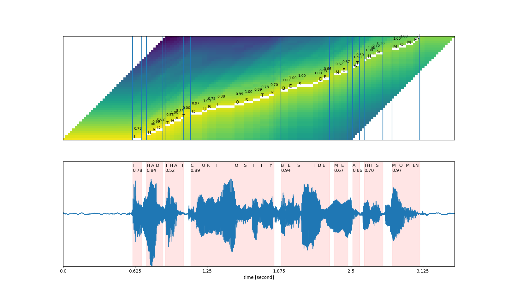
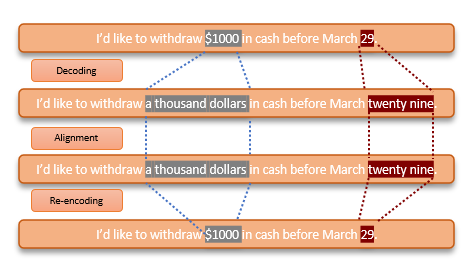
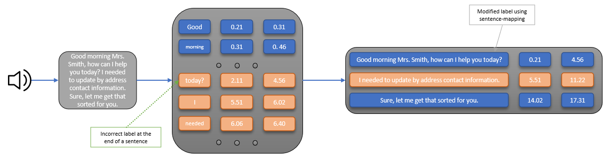

# Towards industrial-level Multi-Speaker Speech Recognition solutions

---
## Table of contents
- [1. Introduction](#introduction)
- [2. Description](#description)
- [3. Components](#components)
- [4. IAM](#iam)
- [5. Quickstart](#quickstart)
- [6. Call for contributions](#call-for-contributions)
- [7. License](#license)
---


## Introduction

In recent years, speech recognition technology has become ubiquitous in our daily lives, powering virtual assistants, smart home devices, and other voice-enabled applications. However, building a robust speech recognition system is a complex task that requires sophisticated algorithms and models to handle the challenges of different accents, background noise, and multiple speakers.

In this repository, we aim to provide a comprehensive overview of the latest advancements in speech recognition and speaker diarization using deep learning techniques. We will explore the underlying technologies, including neural networks and their variants, and provide code examples and tutorials to help developers and researchers get started with building their own speech recognition and speaker diarization systems by making minimal changes to the Azure Pipelines implementation provided.


## Description

Speech recognition is the task of automatically transcribing spoken language into text. It involves developing algorithms and models that can analyze audio recordings and identify the words and phrases spoken by a user. In recent years, deep learning models have shown great success in improving speech recognition accuracy, making it a hot topic in the field of machine learning.

Autoregressive models such as [Whisper](https://openai.com/research/whisper) provide excepcional transcriptions when combined with some additional preprocessing features, that we have picked up from [this excellent repo](https://github.com/guillaumekln/faster-whisper), being the quality of the timestamps returned for each audio segment rather poor. In this direction, phoneme-based speech recognition tools like [wav2vec2](https://ai.facebook.com/blog/wav2vec-20-learning-the-structure-of-speech-from-raw-audio/) handle timestamps perfectly, as these are finetuned to recognise the smallest unit of speech distinguishing one word from another.

A technique that makes both ends meet is [forced alignment](https://linguistics.berkeley.edu/plab/guestwiki/index.php?title=Forced_alignment#:~:text=Forced%20alignment%20refers%20to%20the,automatically%20generate%20phone%20level%20segmentation.); a good introduction to this topic can be found [here](https://pytorch.org/audio/stable/tutorials/forced_alignment_tutorial.html), and our implementation relies on [whisperX repo](https://github.com/m-bain/whisperX).



Alignment can only be performed, however, when both model's vocabulary is matched. To overcome this issue, we pay attention to numerical characters, together with special ones (e.g. `$`, `%` or `@`), and preserve their absolute position within the whole transcription to make the reverse problem simpler to solve, as the conversion from characters into words and/or special characters is an $O(n)$ challenge.



Speaker diarization, on the other hand, is the process of separating multiple speakers in an audio recording and assigning each speaker to their respective segments. It involves analyzing the audio signal to identify the unique characteristics of each speaker, such as their voice, intonation, and speaking style. Speaker diarization is essential in applications such as call center analytics, meeting transcription, and language learning, where it is necessary to distinguish between different speakers in a conversation.

In this direction, [Multi-scale systems](https://developer.nvidia.com/blog/dynamic-scale-weighting-through-multiscale-speaker-diarization/) have emerged as a feasible solution to overcome traditional problems attached to time window selection. In our work, we make use of previous steps to enhance and optimise diarization runtime by providing segments VAD and accurate, word-level timestamps, which is particularly relevant in long audios.

Finally, in order to enhance natural language transcriptions quality and readability, a punctuation-based sentence alignment strategy has been implemented after both ASR and diarization steps.




## Components

### Nomenclature

Each of the pipeline components is executed within an *AML* computing cluster. These are determined by the **virtual machines** that host them, and whose nomenclature has the following meaning:

* `STANDARD`: *Tier* recommended for VM availability purposes.
* `D`: VMs for any purpose.
* `L`: Optimized in terms of storage.
* `S`: Provides *premium* storage and offers a local SSD for *cache*.
* `M`: Optimized in terms of memory.
* `G`: Optimized in terms of memory and storage.
* `E`: Optimized for *multi-thread* operations in memory.
* `V`: Optimized for intensive graphics work and remote viewing *workloads*.
* `C`: Optimized for high performance computing and ML *workloads*.
* `N`: Available GPU(s).

In order to optimize the resources we use in each module of our process, the following virtual machines are recommended:

* `cpu-cluster`: The default host is `STANDARD_DS11_v2`. In case four processing *cores* are needed, consider using `STANDARD_DS3_v2`, and for CPU-intensive *Machine Learning* training, it is recommended to choose `Standard_DC16ds_v3`.
* `gpu-cluster`: Our recommendation is to use one like `Standard_NC16as_T4_v3` for its exceptional speed-cost tradeoff. Make sure you use a GPU with nvidia CUDA compute capabilities beyond 7.5, to make use of Turing tensor cores.


### Structure

Pipelines, and in particular  AML components, are based on those of [*Kubeflow*](https://www.kubeflow.org/docs/components/pipelines/v1/sdk-v2/), so that the reader will be familiaried with the structure of these projects if he has previously used them. We recommend, in order to maintain good practices and avoid possible errors, to maintain the standardised format that is followed in the components of this project, and to freely manipulate the part of them where the code is entered, conveniently adjusting the other files.

For those components that require GPU acceleration, the corresponding *script* that launches the *job* with the pipeline that contains it is prepared to automatically detect what type of virtual machine is being used, and suitably adapt the configuration file associated with these components. All available VMs in your timezone can be collected from the following [link](https://azureprice.net/).

Now let's see how a component is organized:

```
  ├──<component-name>                         
  │   ├── config                              
  │   │   ├── multi_gpu_config.yaml           # Accelerate config for DistributedDataParallel
  │   │   └── single_gpu_config.yaml          # Accelerate config for single-GPU training
  │   ├── docker      
  │   │   └── Dockerfile                      # File with base image and dependencies (AML will do everything else)
  │   ├── src                                 # Scripts containing additional functionalities
  │   │   ├── dataset.py
  │   │   ├── fitter.py
  │   │   ├── model.py  
  │   │   ...
  │   │   └── utils.py
  │   ├── .amlignore                             
  │   ├── <component-name>.yaml               # Single-GPU component definition
  │   ├── <component-name>_distributed.yaml   # Multi-GPU component definition
  │   └── main.py                             # Entrypoint
  
```

For potential integrations with large-scale training, requiring specific use of optimizers such as [*DeepSpeed*](https://www.deepspeed.ai/) or other types of parallelization such as *DistributedTensorParallel*, please request assistance from the contributors of this repo, to adapt both the configuration files and the virtual execution environment to your needs.

### Register

Hosting your code in a repository is the best way to track changes and serialise releases. However, there are additional functionalities within the AML ecosystem that allow users to *plug and play* with pipelines. By opening a terminal and running the shell script contained in `./setup` folder, with `<workspace-name>` and `<resource-group-name>` as parameters, an instance of your custom components will be created, so that you can prepare, run and monitor pipeline workflows using only the UI (in the `Pipelines` section). 

## IAM

AML computing clusters will use a service account to which we must assign a series of roles in order to execute these processes successfully:
* Storage Blob Data Contributor (in storage account resource)
* Storage Queue Data Contributor (in storage account resource)
* AzureML Data Scientist (in AML resource)
* Access to [KeyVaults](https://learn.microsoft.com/en-us/azure/key-vault/general/assign-access-policy?tabs=azure-portal)


## Quickstart

Once the environment has been created, permissions for service account have been granted and you filled the configuration file with your own data, the fastest way to run AML pipelines is by opening a terminal and running the provided script to start an AzureML job:

```
cd parallel_job
python parallel_job.py --config_path ./config/parallel_job.yaml
```

## Call for contributions

Despite including and end-to-end solution to model design in AML, the following additional features are expected to be developed:

- [X] Speed up diarization step by using aligned ASR output.
- [X] Include CTranslate2 engine in ASR components.
- [X] Improve preprocessing techniques in an individual component to enhance stability.
- [X] Parallelise processing using distributed, asynchronous clusters.
- [X] Enhance benchmark logging and CUDA capabilities checking.
- [ ] Make sentence alignment more sensitive to short texts.


## License
Released under [MIT](/LICENSE) by [@hedrergudene](https://github.com/hedrergudene).